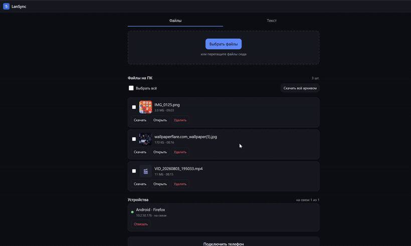
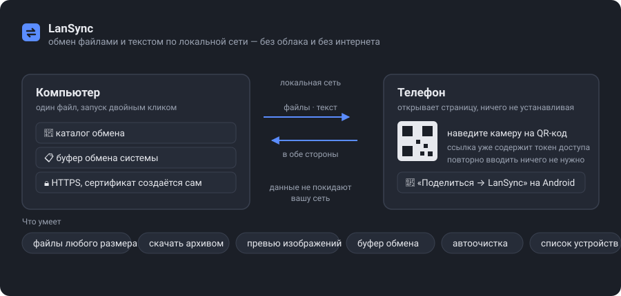

# LanSync

Обмен файлами и текстом между компьютером и телефоном по локальной сети. Без облака, без
интернета, без установки приложения на телефон.

Сервис поднимается на компьютере одним файлом. Телефон открывает страницу по QR-коду — и
дальше файлы и текст ходят в обе стороны. Данные не покидают вашу сеть.



<sub>Запись целиком, со звуком отключённым и в лучшем качестве —
[docs/media/demo.mp4](docs/media/demo.mp4) (0.9 МБ, 1:36).</sub>

## Что умеет

**Файлы в обе стороны.** Множественный выбор и drag&drop на компьютере. Каждый файл идёт
отдельно, со своим прогрессом, отменой и кнопкой «Повторить»; одновременно передаются три,
остальные ждут в очереди. Файлы пишутся на диск потоком, поэтому размер не ограничен —
передача файла на 5 ГБ проверена.

**Пакетные операции.** Галочки у файлов, «Выбрать всё», скачивание выборки одним ZIP-архивом
и удаление выбранного одним запросом. Архив собирается на лету, без временных файлов на диске.

**Превью.** Для изображений строятся миниатюры, для остальных типов показывается значок.
Кнопка «Открыть» проигрывает видео и показывает картинки прямо в браузере, с поддержкой
перемотки.

**Текст и буфер обмена.** Отправка текста, история последних 50 записей, кнопка «В буфер ПК»
кладёт запись прямо в буфер обмена компьютера. Удобно для ссылок, кодов из СМС и команд.

**«Поделиться → LanSync».** После установки на домашний экран приложение появляется в
системном меню «Поделиться» — фото уходит на компьютер в два тапа, без захода на страницу.
Только Android: iOS этот механизм не поддерживает.

**Список устройств.** Видно, кто подключён сейчас и когда был на связи в последний раз. Любое
устройство отвязывается отдельно от остальных — потерянный телефон не требует переподключения
всех.

**Автоочистка.** Принятые файлы старше заданного срока удаляются сами, каталог не растёт
бесконечно.

**Мгновенное обновление.** Всё, что появилось на одном устройстве, тут же видно на остальных —
через WebSocket, без обновления страницы.

**Управление без терминала.** Кнопка «Выключить» и галочка автозапуска — на самой странице.
Повторный двойной клик по файлу открывает интерфейс уже работающего приложения.

## Установка

Скачайте один файл со [страницы релизов](../../releases) и запустите. Node.js и вообще
что-либо ставить не нужно — внутри уже всё есть.

| Система | Файл | Что сделать после скачивания |
|---|---|---|
| Windows | `lansync-windows-x64.exe` | двойной клик |
| macOS (Apple Silicon) | `lansync-macos-arm64` | `chmod +x` и снять карантин, см. ниже |
| Linux | `lansync-linux-x64` | `chmod +x lansync-linux-x64` |

Готового файла для **Intel-маков** нет: раннер, на котором он собирался, выведен из
эксплуатации, а пришедшие ему на смену платные не входят в бесплатные минуты. Собрать
самостоятельно — `npm ci && npm run build:binary`, нужен Node.js 22 или новее.

**Windows.** При первом запуске разрешите входящие подключения одной командой — иначе
телефон не откроет страницу:

```
lansync-windows-x64.exe --allow-firewall
```

Появится запрос прав администратора; правило создаётся один раз. Если пропустить этот шаг,
приложение само напомнит о нём при запуске.

**macOS.** Файл не подписан сертификатом Apple, поэтому система помещает его в карантин:

```bash
chmod +x lansync-macos-arm64
xattr -dr com.apple.quarantine lansync-macos-arm64
./lansync-macos-arm64
```

**Linux.** Для доступа к буферу обмена компьютера нужен `xclip` (X11) или `wl-clipboard`
(Wayland) — без них работает всё, кроме кнопки «В буфер ПК». Для имени `.local` в сети
пригодится `avahi-daemon`, но адрес по IP работает и без него.

```bash
chmod +x lansync-linux-x64
./lansync-linux-x64
```

### Предупреждение о сертификате

Соединение идёт по HTTPS с самоподписанным сертификатом — он создаётся при первом запуске и
лежит в `~/LanSync/tls/`. При первом заходе браузер покажет предупреждение: нужно один раз
выбрать «Дополнительно» → «Перейти на сайт». Дальше страница открывается обычным образом.

HTTPS здесь не про шифрование ради шифрования: браузеры выдают доступ к буферу обмена,
офлайн-режиму и системному меню «Поделиться» только в защищённом контексте. Без HTTPS половина
возможностей приложения была бы недоступна.

Сертификат выписывается на все текущие адреса машины и перевыпускается автоматически, если
адрес изменился. Если HTTPS мешает — отключается переменной `LANSYNC_TLS=0`, но вместе с ним
отключатся буфер обмена на телефоне, установка на домашний экран и «Поделиться».

## Как включать и выключать

Всё делается либо двойным кликом, либо кнопками на странице — командная строка не нужна.

| Что нужно | Как |
|---|---|
| Запустить | двойной клик по файлу |
| Открыть интерфейс, когда уже запущено | двойной клик по тому же файлу — он определит, что приложение работает, и просто откроет страницу |
| **Выключить** | кнопка **«Выключить LanSync»** на странице, в блоке «Этот компьютер» |
| Запускать вместе с системой | галочка **«Запускать вместе с системой»** там же |

Пока приложение запущено двойным кликом, открыто окно консоли — **это и есть работающая
программа**, закрытие окна её останавливает. Если окно мешает, включите автозапуск: тогда
приложение стартует скрыто, без окна, и переживает перезагрузку.

**Переживёт ли перезагрузку:** запустили двойным кликом — нет, нужно запустить снова;
включили автозапуск — да, стартует само и скрыто.

### Команды, если удобнее из терминала

```
lansync                     запустить (или открыть, если уже запущено)
lansync --open              открыть интерфейс в браузере
lansync --stop              остановить
lansync --status            что настроено на этой машине
lansync --allow-firewall    разрешить входящие подключения (Windows)
lansync --install-autostart запускать вместе с системой
lansync --remove-autostart  отключить автозапуск
lansync --help              полная справка
```

Автозапуск реализован штатными средствами каждой ОС: папка «Автозагрузка» в Windows
(скрытый запуск через VBScript), LaunchAgent в macOS, пользовательский юнит systemd в Linux.

## Настройки

Задаются переменными окружения:

| Переменная | По умолчанию | Назначение |
|---|---|---|
| `LANSYNC_PORT` | `8420` | Порт HTTPS. Перенаправление с HTTP слушает соседний порт (`8421`) |
| `LANSYNC_DIR` | `~/LanSync` | Каталог данных (внутри — `inbox` с файлами, сертификат, история) |
| `LANSYNC_NAME` | имя хоста | Как компьютер подписан в интерфейсе |
| `LANSYNC_HOST` | `0.0.0.0` | Интерфейс прослушивания |
| `LANSYNC_TLS` | вкл. | `0` — работать по обычному HTTP (отключит буфер обмена, PWA и «Поделиться») |
| `LANSYNC_KEEP_DAYS` | `0` | Удалять принятые файлы старше N дней. `0` — не удалять |
| `LANSYNC_WATCH_CLIPBOARD` | выкл. | `1` — следить за буфером обмена ПК и публиковать его содержимое |
| `LANSYNC_MDNS` | вкл. | `0` — не анонсировать сервис через mDNS |
| `LANSYNC_NO_BROWSER` | выкл. | `1` — не открывать браузер при старте |

Пример: хранить файлы на диске D и убирать их через неделю.

```bash
LANSYNC_DIR=D:\Обмен LANSYNC_KEEP_DAYS=7 lansync
```

## Пределы

| Что | Значение |
|---|---|
| Размер одного файла | не ограничен — упирается только в диск |
| Сколько файлов можно выбрать | сколько угодно, порога нет |
| Одновременных передач | 3, остальные в очереди |
| Файлов за один запрос к API | 50 (интерфейс шлёт по одному и с этим не сталкивается) |
| Размер ZIP-архива | не ограничен, при выборке свыше 4 ГБ включается ZIP64 |
| Текстовых записей в истории | 50, до 100 000 символов каждая |
| Тайм-аут передачи | отсутствует |

Размер файла ничем не ограничивается искусственно, а приём идёт потоком: передача файла на
5 ГБ проверена — память сервера при этом выросла с 91 до 148 МБ, то есть файл не собирается
в памяти. Реально мешают только свободное место, файловая система (на FAT32-флешке потолок
4 ГБ на файл, на NTFS его нет) и скорость Wi-Fi: 5 ГБ по сети идут несколько минут.

## Доступ

При первом запуске генерируется общий токен и сохраняется в `~/LanSync/config.json`. Он вшит
в ссылку из QR-кода, поэтому вручную его вводить обычно не нужно.

Общий токен работает как код привязки: отсканировав QR, устройство сразу обменивает его на
**персональный токен**. Благодаря этому каждое устройство отзывается отдельно.

- Запросы **с самого компьютера** проходят без токена — иначе пришлось бы копировать секрет
  в собственный браузер.
- Общий токен продолжает действовать и удобен для скриптов.
- QR-код, отзыв устройств, смена токена и управление приложением доступны **только с компьютера**.

Три способа разорвать доступ:

| Действие | Где | Что делает |
|---|---|---|
| «Отключиться» | на телефоне | устройство забывает свой токен |
| «Отвязать» у устройства | на компьютере | отзывает одно устройство |
| «Отключить все устройства» | на компьютере | меняет общий токен и отвязывает всё |

Без токена любой человек в той же сети — включая гостевой Wi-Fi в кафе — мог бы читать
и писать ваши файлы.

## Если телефон не видит компьютер

1. **Брандмауэр Windows.** Самая частая причина. Разрешить:
   `lansync --allow-firewall`. Если правило уже добавляли, проверьте, что его профиль
   совпадает с текущей категорией сети: при переходе с домашнего Wi-Fi на офисный она
   меняется, и старое правило перестаёт действовать.

   ```powershell
   Get-NetConnectionProfile                     # текущая категория сети
   Get-NetFirewallRule -DisplayName "LanSync*"  # какие правила уже есть
   ```

   Вручную, от администратора (подставьте свой профиль и порт):

   ```powershell
   New-NetFirewallRule -DisplayName "LanSync 8420" -Direction Inbound -Protocol TCP -LocalPort 8420 -Profile Public -RemoteAddress LocalSubnet -Action Allow
   ```

   `-RemoteAddress LocalSubnet` оставляйте: он пускает только устройства из вашей же подсети.

2. **Одна ли это сеть.** Телефон и компьютер должны быть в одной подсети. Частая ошибка —
   телефон в гостевой сети роутера или в мобильном интернете.
3. **Изоляция клиентов (AP isolation).** На гостевых сетях и в некоторых роутерах устройства
   не видят друг друга. Проверить: откройте на телефоне адрес из строки со стрелкой `←`.
   Если не открывается — ищите в настройках роутера «изоляция клиентов» / «AP isolation».
4. **Не тот адрес.** Если стрелка указала не на тот адаптер, попробуйте другие адреса из
   списка вручную, добавив `/?t=<токен>`.
5. **Старая закладка на `http://`.** После включения HTTPS прежние ссылки не работают:
   отсканируйте QR-код заново.

## Известные ограничения

- **Нет значка в трее.** Настоящий значок возле часов требует нативного кода на каждой ОС,
  а это ломает главное свойство поставки — один файл без зависимостей. Его роль играют
  страница приложения и повторный двойной клик по файлу.
- **«Поделиться → LanSync» только на Android.** iOS не поддерживает Web Share Target.
- **Миниатюры только для изображений.** Превью строит отправитель средствами браузера, так что
  форматы ограничены его возможностями: HEIC с iPhone обычно не декодируется, и вместо превью
  будет значок. Кадр из видео потребовал бы ffmpeg — тоже значок.
- **Подпись исполняемых файлов отсутствует.** На macOS нужно снять карантин вручную,
  Windows SmartScreen может предупредить при первом запуске.
- **Компьютер должен работать.** Топология «ПК как хаб»: если компьютер выключен или спит,
  обмен недоступен.
- **Нет докачки.** Оборванная передача начинается заново.

## Как это работает



Один процесс Node на компьютере раздаёт HTTPS API, мобильную страницу и рассылку событий по
WebSocket. Клиент — обычные HTML, CSS и ES-модули, отдаваемые как есть, без сборщика. Файлы
пишутся и читаются потоками; в собранном виде статика лежит внутри исполняемого файла.

Подробнее — [docs/architecture.md](docs/architecture.md).

## Документация

- [docs/architecture.md](docs/architecture.md) — как всё устроено и почему принято именно так
- [docs/api.md](docs/api.md) — полное описание HTTP API и событий WebSocket
- [docs/pitfalls.md](docs/pitfalls.md) — грабли, на которые уже наступали, и почему сделано
  не самым очевидным способом
- [CLAUDE.md](CLAUDE.md) — сводка для продолжения разработки: ограничения проекта, порядок
  проверки, что сознательно не сделано

## Разработка

Нужен Node.js 22 или новее. Ниже не получится: тесты используют `import.meta.dirname`
(появился в 21.2), а упаковка в один файл — `node:sea` с `getRawAsset` (20.12). CI собирает
на Node 24.

```bash
npm install
npm run dev            # запуск с автоперезагрузкой
npm test               # 26 тестов: API, авторизация, автоочистка, санитизация имён
npm run smoke          # сквозная проверка по LAN-адресу против запущенного сервера
npm run build          # компиляция в dist/
npm run build:binary   # один исполняемый файл в dist-bin/
```

`npm run smoke` обращается к серверу по адресу машины в локальной сети, а не по localhost:
запросы с loopback авторизуются по адресу, поэтому только так включается логика токенов,
привязки и отзыва устройств.

### Сборка на GitHub

Два workflow, оба собирают под все платформы на их собственных системах:

| Файл | Когда | Что делает |
|---|---|---|
| `.github/workflows/ci.yml` | каждый push и pull request | типы, 26 тестов, синтаксис и связность клиента — на Windows, Linux и macOS; затем пробная сборка исполняемого файла на каждой из них |
| `.github/workflows/release.yml` | push тега `v*` | то же плюс публикация готовых файлов в релиз |

Выпуск версии:

```bash
git tag v0.3.0
git push origin v0.3.0
```

Кросс-сборка возможна технически, но для macOS требует переподписи бинарника средствами
самой macOS (`codesign`) после внедрения полезной нагрузки — без неё Gatekeeper не даёт
запустить файл. Поэтому каждая платформа собирается на своём раннере: `windows-latest`,
`ubuntu-latest` и `macos-latest` (Apple Silicon).

Сборки под Intel-маки в матрице нет. Она делалась на `macos-13` — последнем бесплатном
Intel-раннере; GitHub его убрал, а замены (`macos-15-intel`, `macos-26-intel`) относятся
к платным «larger runners» и тарифицируются даже в публичных репозиториях.

Сборка проверяется и на обычных push, а не только при выпуске: ломается она обычно от смены
зависимостей, и узнавать об этом в момент релиза поздно.

### Структура

```
src/server/
  index.ts           CLI и запуск: печать адреса, QR, mDNS, перенаправление с HTTP
  app.ts             сборка сервера, плагины, роуты
  config.ts          конфигурация и общий токен
  auth.ts            проверка токенов (общий и персональные)
  tls.ts             самоподписанный сертификат
  devices.ts         реестр привязанных устройств
  autostart.ts       автозапуск средствами ОС
  firewall.ts        правило брандмауэра Windows
  network.ts         выбор сетевого адреса
  events.ts          рассылка событий по WebSocket
  clipboard.ts       буфер обмена компьютера
  thumbs.ts          миниатюры изображений
  cleanup.ts         автоочистка каталога
  static.ts          отдача клиента с диска или из недр бинарника
  store/             файлы и история текста
  routes/            HTTP API
src/web/             клиент: обычные HTML/CSS/JS, без сборки
scripts/             сборка бинарника, сквозная проверка
test/                тесты
```

Клиент намеренно без бандлера: правки видны сразу после обновления страницы.

### Перенос на другую машину

Достаточно `git clone` и `npm install`. Контекст разработки лежит в репозитории: `CLAUDE.md`
(подхватывается Claude Code автоматически), `docs/pitfalls.md`, `.claude/skills/verify/` и
`.claude/settings.json`.

Единственная нативная зависимость `sharp` лежит в `optionalDependencies`: если она не
соберётся, `npm install` не упадёт, а превью будут строиться на стороне отправителя.

## Дальше

Подпись исполняемых файлов (убрала бы предупреждения SmartScreen и карантин macOS), докачка
после обрыва, нативный клиент поверх того же API.
